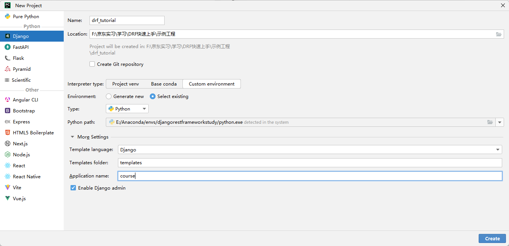
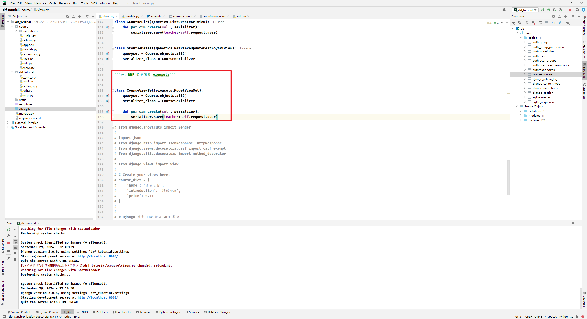
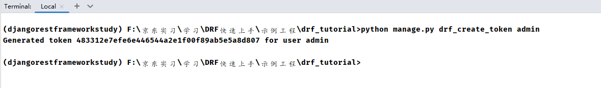
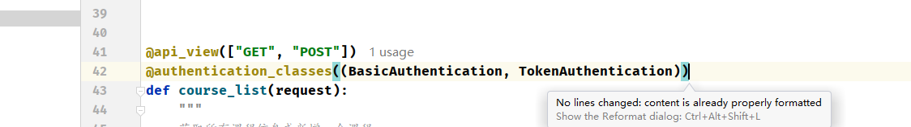
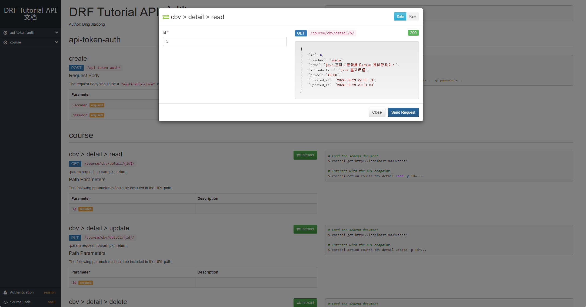

### 3 小时搞定 DRF 框架【笔记 - 丁家雄】

视频地址：https://www.bilibili.com/video/BV1Dm4y1c7QQ/?spm_id_from=333.337.search-card.all.click&vd_source=2ac1fc0ca6d6b70e89f28db9136de293

课程名：`Django REST framework` 快速入门

#### 1. 课程内容与导学

- 学习目标：使用 DRF 开发 RESTful API 接口
- 学习内容
    - 序列化
    - 视图集
    - 路由
    - 认证
    - 权限
- 课程效果：DRF 的多种视图实现课程信息的增删改查

#### 2. 前后端分离理解

- 交互形式

  

- 代码组织方式

  

- 开发模式

  前后端不分离：

  

  前后端分离：

  

- 数据接口规范流程

  

#### 3. 深入理解 RESTful API

【最佳实践】

- 协议
- 域名
- 版本
- 路径
- HTTP 动词
- 过滤信息
- 状态码
- 错误处理
- 返回结果
- Hypermedia API

> https://www.imooc.com/article/304756
>
> 

注意 PUT 和 PATCH 的区别

#### 4. Pycharm 搭建开发环境

新建了一个虚拟环境

Django 版本应该是上到最新了

好吧，是 4.1 ，试着用吧 就

修改了 `settings.py`，然后生成了数据库文件，直接启动登录了管理员界面

#### 5. DRF 介绍与安装

官网：https://www.django-rest-framework.org/

直接装上这些依赖，其实吧， Django 就退回去了

搞了一些配置，然后生成数据表，接着是修改路由

这样其实就已经登录成功了。

DRF 模块图：【20 个 模块，不知道现在是不是】

真淦啊，现在我觉得不止了，这都 4 年前的视频了

#### 6. 开发课程信息模型类

加入后台

生成数据表

创建完成

#### 7. 什么是序列化

- 序列化：对象 → 字节数据
- 反序列化：字节数据 → 对象

后台插入一条数据

console 里面看看序列化效果

确实转成 json 数据了，这是 Django 自带的序列化器

但是这种方式存在一定的缺陷不足：

- 验证处理
- 验证器的参数
- 同时序列化多个对象
- 序列化的过程中添加上下文
- 无效的数据异常处理

#### 8. 继承 ModelSerializer 序列化模型类

使用 DRF 的序列化

课程信息表单、用户模型类、课程模型类

#### 9. 带URL的 HyperlinkedModelSerializer

其实就是在字段中加上一个URL，然后继承的类不同

#### 10. 使用 Django 的 views 开发 RESTful API 接口

四种不同的方式：

1. 函数式编程 FBV
2. 类视图 CBV
3. 通用类视图 GCBV
4. DRF 的视图集 viewsets

Django 的原始方式就是使用 函数式编程 和 类视图编程

这种原始的开发方式的不足：

1. 分页
2. 排序
3. 认证
4. 权限
5. 限流
6. 等等都要自己实现

#### 11. DRF 中的装饰器api_view

- 函数式编程 FBV

来吧测试一下

还要在 总路由中加入

启动访问

需要登录，当前之前的登录我退出了

没问题，这是 orm 从数据库里面查出来的

测试一下 post 请求

发送

返回了 post 结果，没问题，再查一次

这样就是 两条数据库了，看看数据库

没问题，这就是查看课程列表 和 添加课程信息 的两个接口相当于，

继续：

加入路由

试试

这就是查单个，没问题，能用

#### 12. 使用 POSTman 测试 API 接口

教程那个也太老了

需要认证，这都是框架完成的

可以的，这个我还是第一次用，之前都是在 header 里面加东西

注意最后那里的 `/` 必须要，不然会报错，添加成功，再查一次

没问题，再来一个查单个的吧

没问题，更新

删除

没问题

#### 13. DRF 中的视图 APIview

之前是函数式的，现在学习另一个

- 类视图 CBV

加个路由

来吧，测试

没问题的，post

没问题

一样的，还有单个课程信息的相关接口

挺清晰的，加入路由

测试

没问题，删除我就不试了

其实到现在总的看来，类视图和函数式好像都差不多，重复代码挺多的，我们继续看

#### 14. DRF 中的通用类视图 GenericAPIView

- 通用类视图 GCBV

来吧，直接开新接口

这就太简单了，直接试试吧

还返回了总个数，可以的，创建一个试试

创建也没有问题

更新没问题

那就先这样

#### 15. DRF 中的视图集 viewsets 完成课程信息的增删改查

其实通用类视图代码量已经好很多了，但是还能再简单

完事儿了，就这样直接完成了之前的所有功能

#### 16. Django 的 urls 与 DRF 的 Routers

之前我们已经完成了 视图集 方式的接口开发，很简单

接下来编写路由

来吧，测试一下

没问题，新建

添加成功

再试试更新

没问题，试到这儿

其实也可以部分更新

试试效果

没问题，这也直接就写好了，如果是函数式，还要自己加参数，可以的，老 Java 选手感觉还行

【反转】 这样写路由也太麻烦了，还有一种非常简单的方法

测试

没毛病的

单个也没有问题， 6

#### 17. DRF 认证方式介绍

认证和权限校验不同，认证更多的是说看这个请求是否已经登录或者 说 登录的身份进行校验...

权限：

一个已经登录的用户：

- 能够访问哪些接口
- 或者说能够从某个接口获取哪些（什么级别）数据

整个流程：认证肯定是发生在权限以及限流检查之前的【认证优先级最高，最先被执行】

这个里面的密文是可以解密的，不安全，一般 basic 多用于测试环境，生产环境一般不用

一个 请求过来

可以看到这个 request 中的信息

如果 basic 认证失败

响应头 会多出这个数据，这是 basic 认证 的特点，session 认证就不会添加这个额外信息，当然它也会生成一个 Django 的 User 和 赋值auth

#### 18. Django 信号机制自动生成 Token

其实之前我们已经引入了，

而且生成了数据表

其实就三个字段，来吧，生成一个 Token 试试

有两种方式：

1. 使用 Django 的 manage.py 生成 Token 【这种方式一般就管理员测试用】
2. 通过 Django 的信号机制生成 Token

这样就给 admin 生成了一个 Token

表里面也插入进去了 ，总之这种方式，我们总不可能手动为每一位用户生成一个 Token 吧，所以还是要改一下我们的视图

这整个函数的意思就是在 新增用户时，自动调用，通过传入的用户实例，生成一个 Token，生成完成，对外暴露一个 获取 Token 的接口

试试吧，直接后台新建一个用户

创建完成

设置有效，保存

用户新建好了，看看数据库

没问题， Token 自动新建了，获取一下试试

没问题，这下我们换一种认证方式

这次用 Token 请求，看看赋值是什么情况

没问题，响应头中

没有和 Token 有关的信息，随便 把 Token 改一下

认证令牌无效，

响应头和 basic 认证一样，加入新信息

-----

其实还可以不同的接口使用不同的认证方式

比如说 函数式的，我们只让它用账户密码方式认证

这样用 token 认证就过不去， 加上 Token 认证

再试一次

这样就行了

【注意点：写在接口上的配置，比全局的优先级要高】

这是函数式的写法，直接用装饰器，类视图可以用属性的方式

通用类和视图集 也是，他们都有这个属性

#### 19. DRF 的权限控制

来吧，直接先看函数式的怎么写权限

其实 和 认证一样，也是使用装饰器

对于 类视图、通用类视图、视图集，就能猜到了，属性

当然这个权限校验，我们在全局配置已经配了，所以相当于不写

但是现在的问题就是

我现在用的是 user01 的 token， 我不光可以查全部

我还可以单个查，甚至，我还可以直接 改 admin 的课程

居然更新成功了，哈哈，这很不合理，所以现在的权限需求就是 登录的用户只能删除修改自己的课程，别人的动不了

来一个新权限文件

再来搞到 视图中

其他接口都是一样的道理，试试现在

效果很明显，没有执行这个操作的权限，试试 admin 的 Token

没毛病，卧槽，牛逼， 和认证一样， 写在视图 中的控制 比 全局配置 的优先级更高

#### 20. 如何生成 API 接口文档

虽然 postman 很方便，但是还是自己维护的，来直接生成

先加上 配置

访问看看

这里要装一个 库，装完再试一次

进来了

这个里面就是所有的接口信息

当然这样还不够美观

#### 21. DRF 的概要使用方法

用这个，再访问一次

可以的

妙啊，就这样吧

#### 22. 总结一下

- 开发用哪种视图
    - 函数式灵活，但是冗余，而且面向过程
    - 后面就是越来越不灵活，但是代码量低
    - 根据需要，灵活使用
    - 多数 用类视图
- 还有更多的进阶，加油吧

